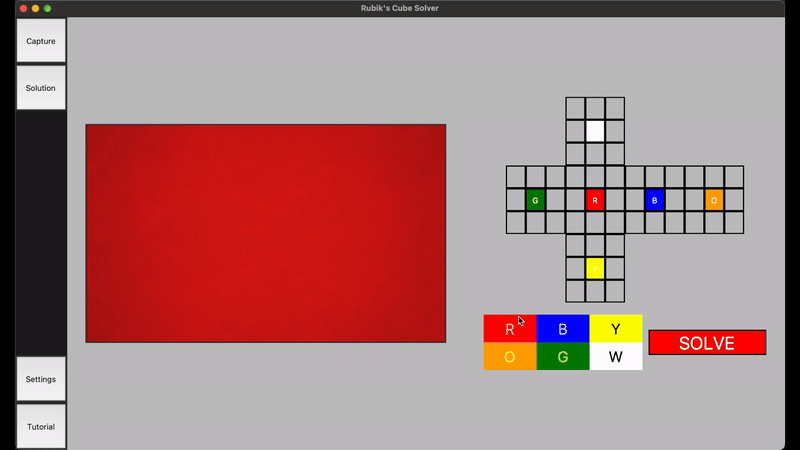

# Rubik's Cube State Recognition + Solver

This project is a Rubik's Cube solver that uses camera-based colour state detection during the capture stage and Thistlethwaite's algorithm in the solving stage.

## Demo

### State capture through computer vision


### State capture through the GUI


## Getting Started

### Prerequisites
- Ensure that Python version 3.11 or later is installed on your system.
- For UNIX systems, verify that `tkinter` is installed (see instructions below).

### Installation

#### Steps
1. **Install Python**
    - Download and install Python (>=3.11) from [the official Python website](https://www.python.org/downloads/)
2. **Install `tkinter` (UNIX systems only)**
    - On macOS
        ```bash
        brew install python-tk@3.11
        ```
    - On Ubuntu
        ```bash
        sudo apt install python3.11-tk
        ```
3. **Clone the repository**
    ```bash
    git clone https://github.com/simran-ss-sandhu/Rubiks-Cube-State-Recognition.git
    ```
4. **Navigate to the project directory**
    ```bash
    cd Rubiks-Cube-State-Recognition
    ```
5. **Set up a virtual environment (optional but recommended)**
    - **Windows**
        ```bash
        python -m venv venv && venv\Scripts\activate
        ```
    - **UNIX (Linux, MacOS, etc.)**
        ```bash
        python -m venv venv && source venv/bin/activate
        ```
6. **Install dependencies**
    ```bash
    pip install -e .
    ```
   
#### Notes
- Ensure you're using a Python version >= 3.11. If you have multiple Python versions installed, you may need to reference a specific version (e.g. `python3.11` instead of `python`)

### Usage
Start the project by using the following command in the project directory:
```bash
python -m rubiks_cube_state_recognition
```
